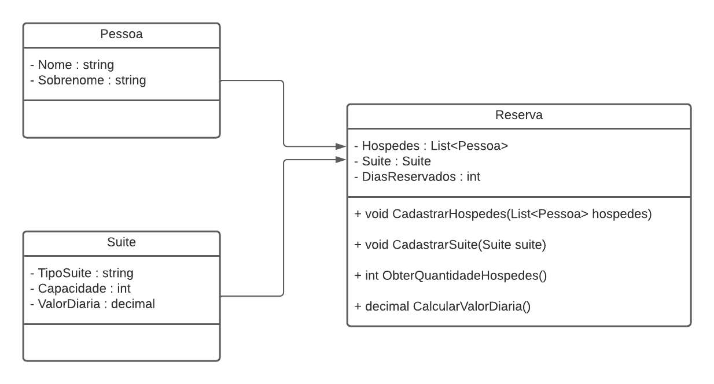

## Context
You have been hired to build a hosting system, which will be used to make a hotel reservation. You will need to use the Person class, which represents the guest, the Suite class, and the Reservation class, which will create a relationship between the two.

Your program must correctly calculate the values ​​of the Reservation class methods, which will need to include the number of guests and the daily rate, granting a 10% discount if the reservation is for a period longer than 10 days.

## Rules and validations
1. It must not be possible to book a suite with a capacity smaller than the number of guests. Example: If it is a suite capable of hosting 2 people, then when 3 guests pass by, an exception should be returned.
2. The ObterQuantidadeHospedes method of the Reservation class must return the total number of guests, while the CalcularDailyValue method must return the daily value (Days reserved x daily value).
3. If a reservation is made for 10 days or more, a 10% discount on the daily rate must be granted.

